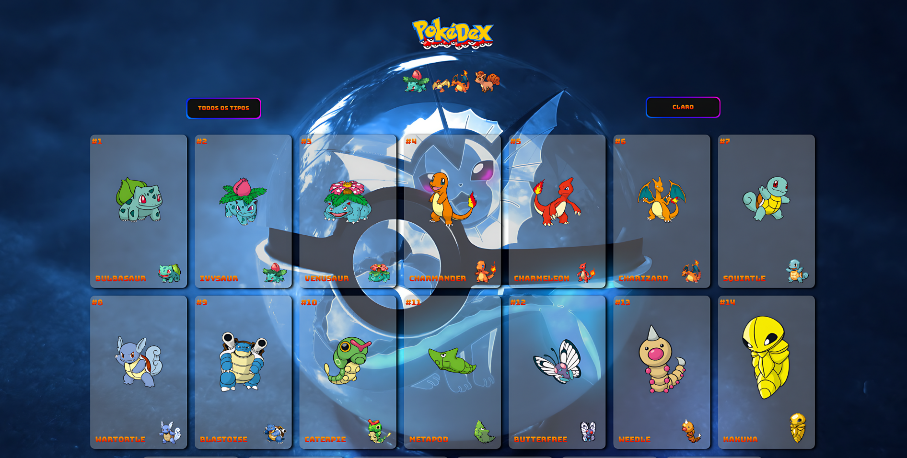
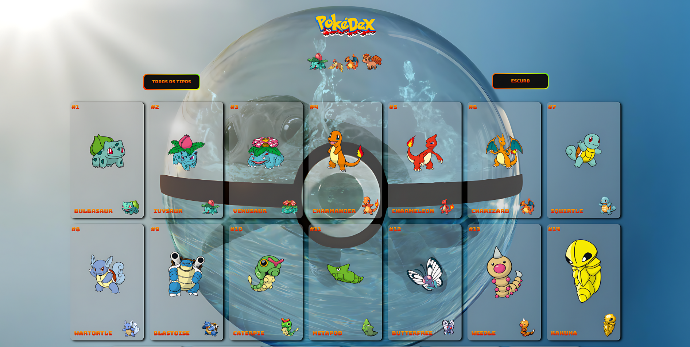

    

##
<h1>PROJETO POKÉDEX</h1>

Projeto mostra 20 Pokémons de início, acima temos um botão DarKMode 
para alterna entre claro e escuro, o botão selecionar, o usuário pode escolher pelo tipo do Pokémon. E abaixo temos o rodapé da página para o usuário adicionar mais 10 Pokémons.

 

<h2>Como utilizar:</h2>

1 - baixe o arquivo zip

2 - Descompacte o arquivo na pasta desejável

3 - Escolha um Editor de código da sua preferência (Eu recomendo o VScode)<a href="https://code.visualstudio.com/">Link para baixar.</a>

4 - Abra o projeto com sua IDE.

5 - Vá até terminal e digite os seguintes comandos -> npm styled-components, e depois npm install react-router-dom.

6 - Execute o projeto, digitando o seguinte comando npm start .

<h3>Ferramentas e Tecnologias utilizadas:</h3>
 
 

1 - styled-components

3 - função -> Create-Global-style

4 - Hooks

